| Nama      | Fahmi Eko Putro Santoso |
| ----------- | ----------- |
| NIM     | 312010046       |
| Kelas   | TI.20.A.1        |

## Langkah langkah praktikum 5
Persiapan membuat dokumen HTML dengan nama file lab5_javascript.html seperti gambar dibawah ini.

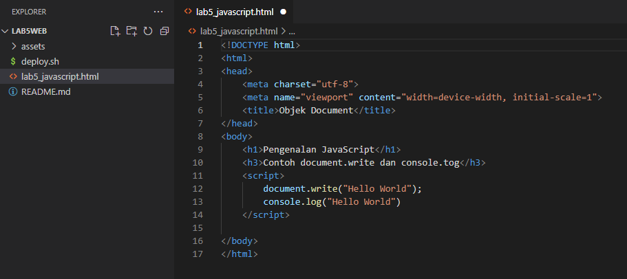

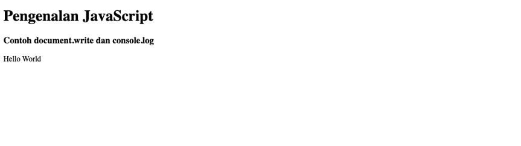

## 1. Javascript Dasar
Pemakaian Alert sebagai property window

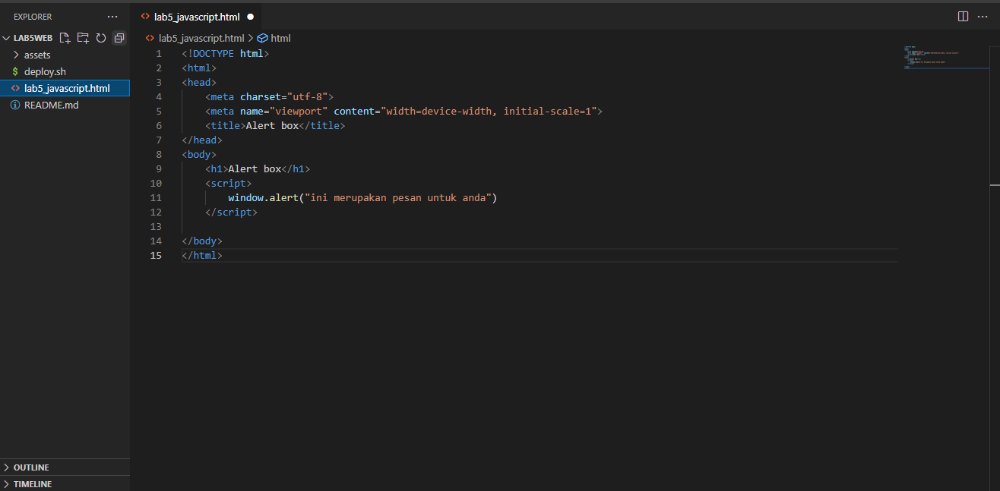

Pemakaian method dalam objek

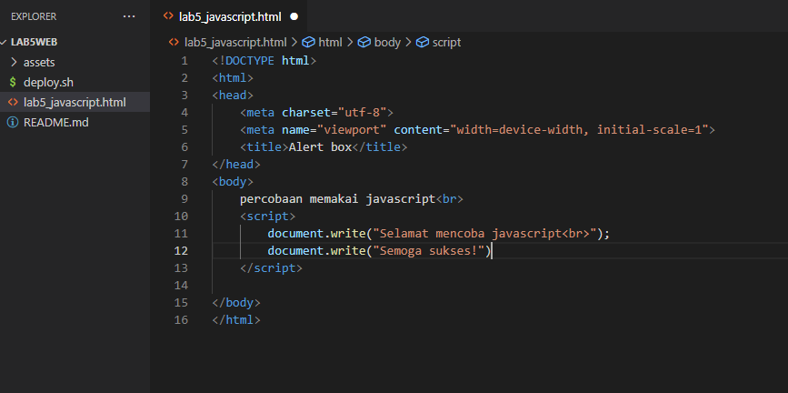

Pemakaian Prompt

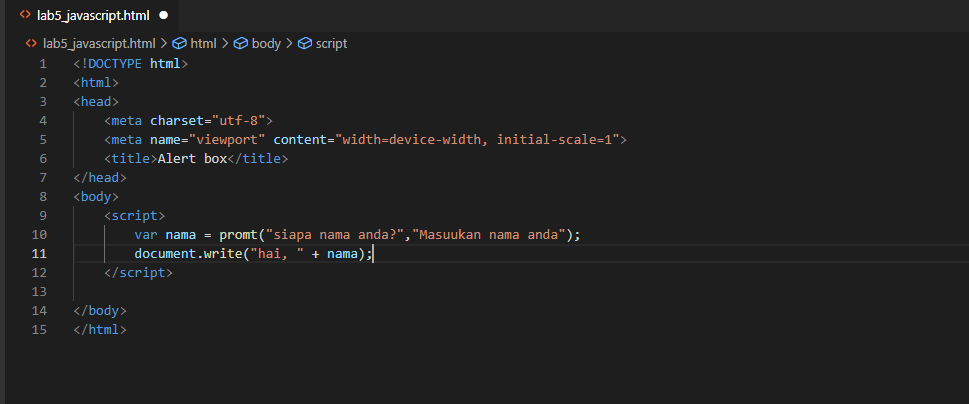

Pembuatan fungsi dan cara pemanggilannya

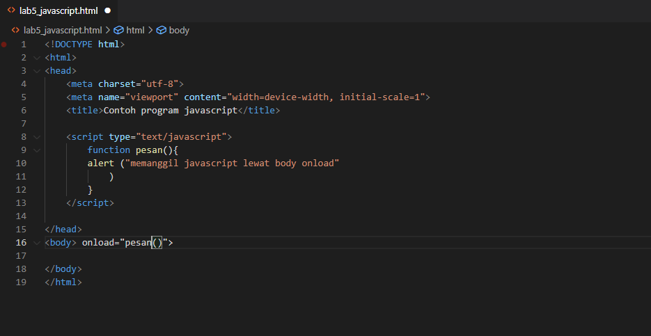

## 2. Dasar Pemrograman Di Javascript
Operasi dasar aritmatika

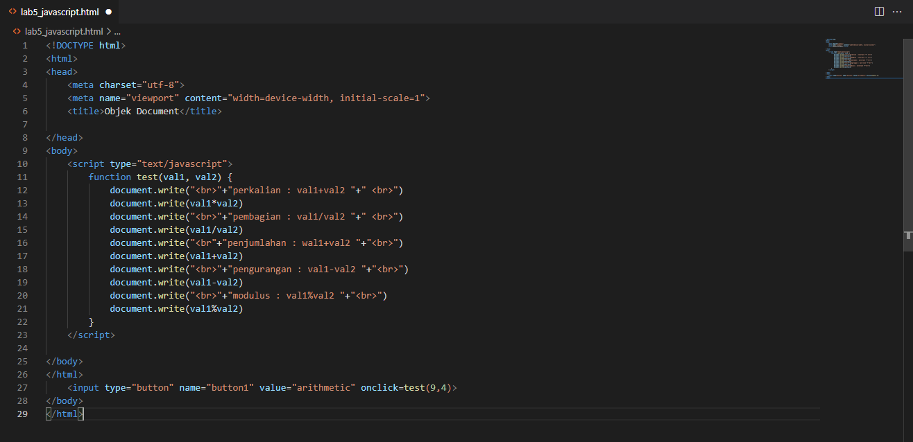

Seleksi kondisi (if..else)

disini saya memasukkan data 90

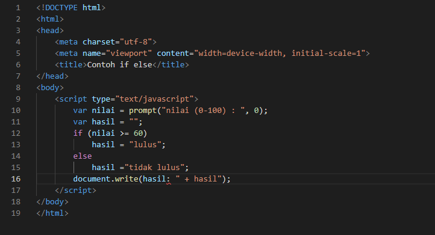

Penggunaan operator switch untuk seleksi kondisi

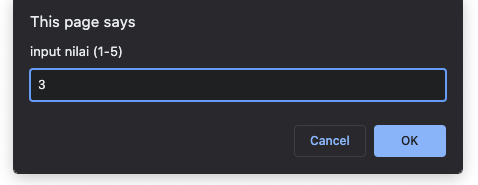

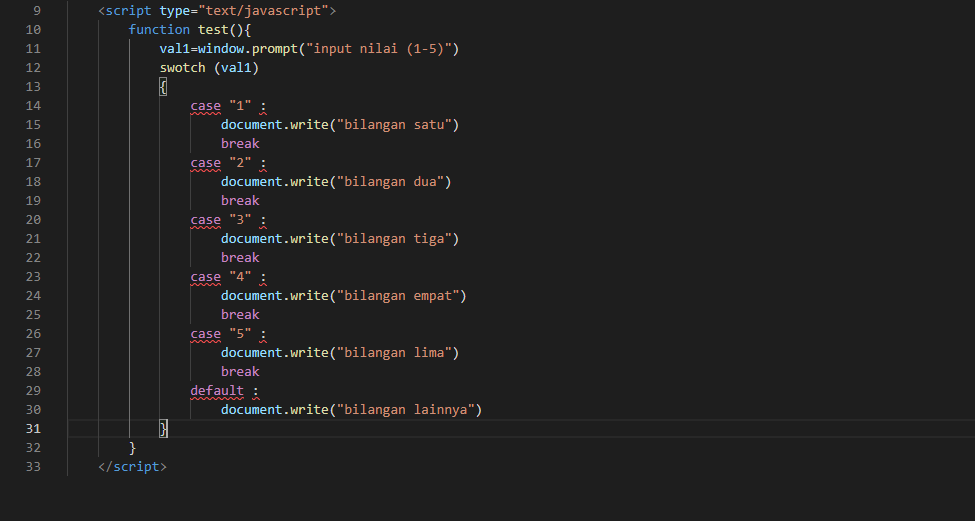

## 3. pembuatan Form
Form input

saya coba input nilai 8

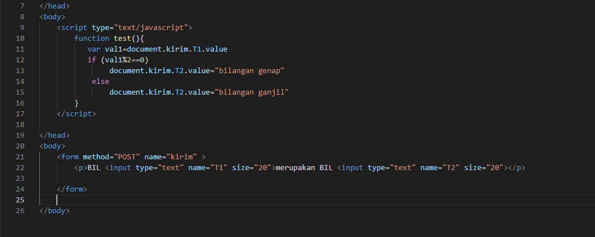

Form button

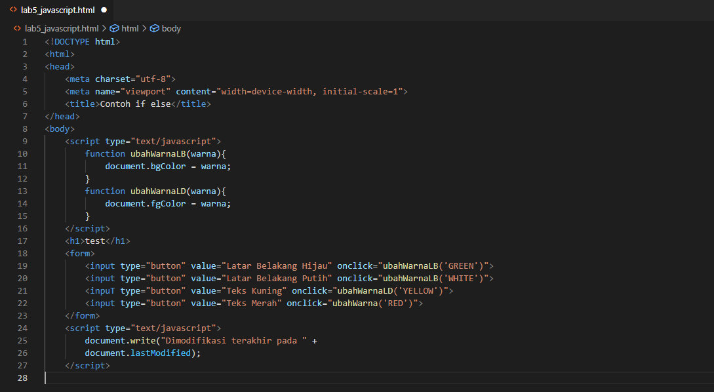

## 4. HTML DOM
Pilihan menggunakan checkBox dengan perhitungan otomatis

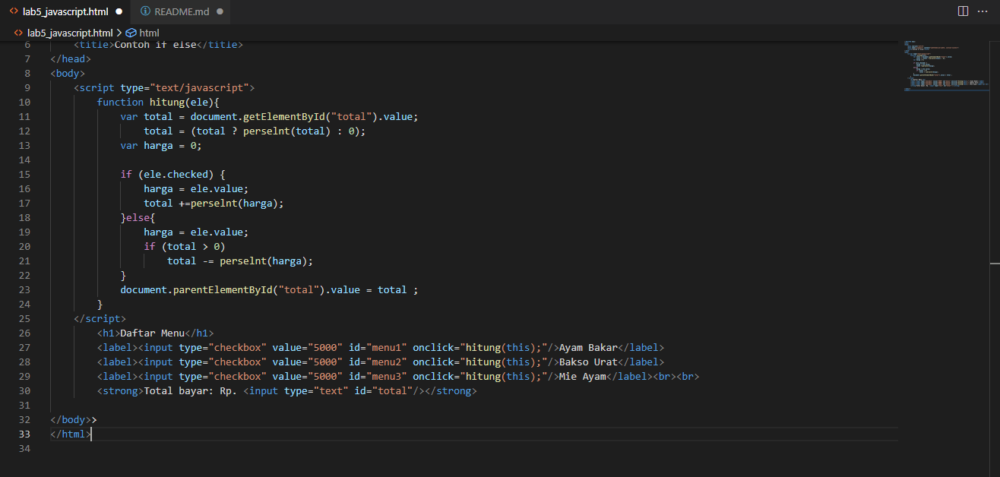

## Pertanyaan dan Tugas
1. Buat script untuk melakukan validasi pada isian form

## Jawab

Membuat validasi nama, no.telp, Email

## 1. Nama
Saya akan memberikan Validasi berupa inputan hanya boleh mengguankan Huruf/Alphabet saja. Contoh: Fahmi Eko (benar), Fahmi Eko 1 (salah).

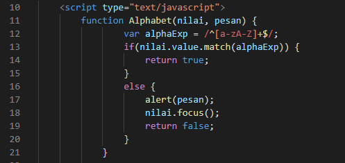

Penjelasan
- Pertama membuat nama function Alphabet, dengan parameter dinamis yaitu (nilai, pesan) dan data yang boleh dimasukkan adalah berupa "a-zA-Z".
- Jika selain data "a-zA-Z" ini dimasukkan, maka akan muncul pesan Alert "alert(pesan);"

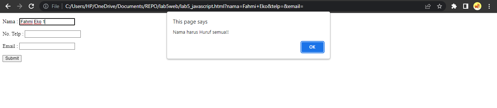

## 2. Nomor Telp
Pada bagian ini akan saya berikan validasi berupa hanya angka saja yang boleh di inputkan, contoh: 12345 (benar), 123ABC (salah).

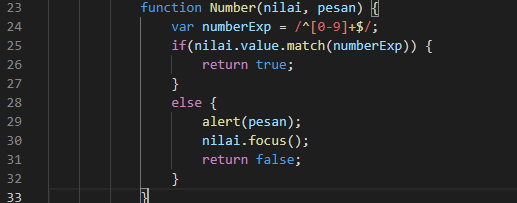

Penjelasan:
- var numberExp = /^[0-9]+$/; merupakan variabel numberExp yang diberi batasan validasi angka 0-9
- Arti Match pada "if(nilai.value.match(numberExp))" adalah string.match(), mencari string menggunakan Regular Expression (Regex)
- Jika salah atau inputan tidak benar maka akan ada pesan alert "alert(pesan);"

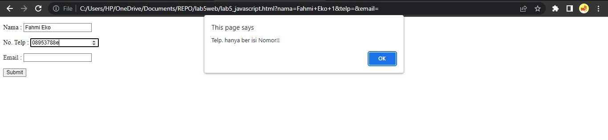

## 3. Email
Pada email akan diberikan validasi masih berupa Regular Expression. Contoh: fahmieko73@gamil.com.com (benar), fahmi eko@gmail. (salah).

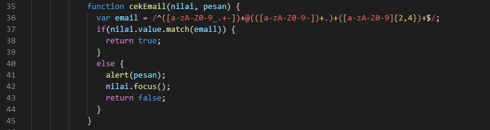

Penjelasan:
- membuat variabel email " var email = /^([a-zA-Z0-9_.+-])+@(([a-zA-Z0-9-])+.)+([a-zA-Z0-9]{2,4})+$/; " berupa huruf, angka dan simbol yang diperbolehkan dalam input sebuah email. Jika email salah maka akan ada pesan alert "alert(pesan);"

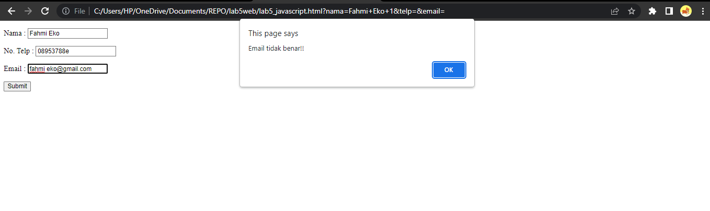

## Berikut ini adalah contoh penulisan form.

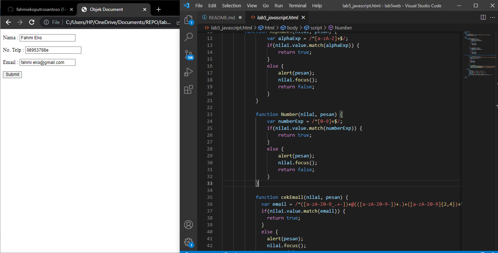

